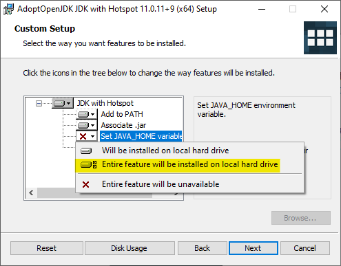
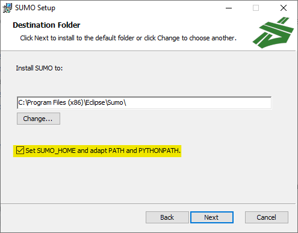

# Installation Guide

This guide describes the steps needed in order to install and configure Eclipse MOSAIC on Debian (i.e. Ubuntu) distributions, Windows, and macOS.
MOSAIC requires [Java](https://www.java.com/en/) and [SUMO](https://www.eclipse.org/sumo/) to be installed; our analysis will be running on [Python](https://www.python.org/),


## Installing Java

Open a terminal on your computer (Linux & Mac: search "terminal"; Windows: search "cmd").

To check if Java is already installed on your computer, type `java --version`.
The output should look similar to this:

```shell
openjdk 18.0.1 2022-04-19
OpenJDK Runtime Environment Homebrew (build 18.0.1+0)
OpenJDK 64-Bit Server VM Homebrew (build 18.0.1+0, mixed mode, sharing)
```

If you get an error message or something similar, you probably need to install Java JDK:

<details>
  <summary>Install on Linux</summary>

  1. Download the [latest LTS release](https://adoptium.net/)
  2. Create a new directory in your home-folder called **adoptopenjdk**
  3. Copy/move the tarball from your download folder to **adoptopenjdk** and open a terminal in this folder
  4. Extract the tarball using `tar xzf OpenJDK17U-jdk_x64_linux_hotspot_17.0.3_7.tar.gz`
  5. The tarball should extract the following folder: **jdk-17.0.3+7**.
  6. Open a new terminal and type in the following commands: First `cd` and then `gedit .bashrc`.
  7. Insert the following line at the end: `export PATH=/home/<USERNAME>/adoptopenjdk/jdk-17.0.3+7/bin:$PATH`, save and exit. You can get your USERNAME using the command `whoami` in a terminal. 
</details>

<details>
  <summary>Install on Windows</summary>

  1. Download the [latest LTS release](https://adoptium.net/)
  2. Double click and run as administrator
  3. **IMPORANT:** You need to set the environment variable **JAVA_HOME**. See next Figure:
  
  
</details>

<details>
  <summary>Install on Mac</summary>

  1. Download the [latest LTS release](https://adoptium.net/)
  2. Install the `.pkg` file just like any other application
  3. Open a new terminal and type `java --version`. It should now be installed.
</details>

Check if the installation was successful by typing `java --version` in a new terminal.


## Installing SUMO

<details>
  <summary>Install on Linux</summary>
  
  In the terminal, type in the following commands:
  
  ```shell
  sudo add-apt-repository ppa:sumo/stable
  sudo apt-get update
  sudo apt-get install sumo sumo-tools sumo-doc
  ```
</details>

<details>
  <summary>Install on Windows</summary>
  
  Download [SUMO](https://sumo.dlr.de/releases/1.9.2/sumo-win64-1.9.2.msi) and install as usual.
  
  **IMPORTANT:** Don't forget to set environment variable **SUMO_HOME**:
  
</details>

<details>
  <summary>Install on Mac</summary>
  
  For macOS you can follow the [official guide](https://sumo.dlr.de/docs/Installing/index.html#macos).
  Note, that the XQuartz or sumo-gui dependencies are not required for this workshop.
  - Install [Homebrew](https://brew.sh/), e.g. via `/bin/bash -c "$(curl -fsSL https://raw.githubusercontent.com/Homebrew/install/master/install.sh)"`
  - Run `brew update`, `brew tap dlr-ts/sumo` and `brew install sumo`
    - The last command should output a path like `export SUMO_HOME="/opt/homebrew/opt/sumo/share/sumo"`
  - From macOS Catalina (10.15) run `open .zshrc`, otherwise `open ~/.bashrc` (or whichever shell you are using)
    - If the above command fails (The file ... does not exist.) first run `touch .zshrc`/`touch .zshrc` and rerun
  - Enter the command outputted by `brew install sumo` as a new line in this file.
</details>

Check if the installation was successful by typing `sumo --version` in a new terminal.


## Installing Python

Make sure you have a working installation of Python 3.6 or newer by running `python --version`.
If you don't, install it using your package manager of choice or the [official website](https://www.python.org/downloads/).

Check if the installation was successful by typing `python --version` in a new terminal.


# Running the Workshop Material

Download this repository using either `git` or simply clicking `Code` -> `Download ZIP` on the GitHub website.

Within the repository directory, we now install the requirements for running the simulation in Jupyter lab:

```
python3 -m venv venv              # create venv
. venv/bin/activate               # activate venv
pip3 install -r requirements.txt  # install dependencies
```

You can now start Jupyter lab by running `jupyter lab`, which should open a new browser window/tab. 
Open `mosaic.ipynb` and sequentially run all cells.

**Congrats!** If all the notebook cells run without errors, you are ready to attend the practical session!
